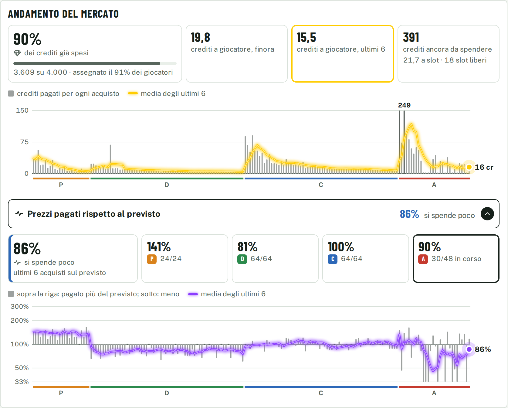

<h1 align="center">
  
</h1>

### 👉 [Apri il tool](https://pimpi7.github.io/FantaOracle/)

Funziona nel browser, da computer e da telefono, senza installare nulla, e segue il tema chiaro o scuro del dispositivo. I dati si aggiornano da soli ogni martedì e venerdì. Piani, impostazioni e asta restano salvati nel tuo browser: niente account, niente server.


---

## Perché non basta la fantamedia

La fantamedia ti dice quanto ha preso un giocatore *quando ha giocato*. Ma chi gioca metà delle partite ti porta metà dei punti, un portiere da 5 e mezzo di media è un'altra cosa se la sua difesa ti regala il modificatore, e il nome in voga costa il doppio di quanto vale.

FantaOracle mette insieme tre stagioni di voti Fantacalcio.it, le prime giornate di quest'anno, le statistiche avanzate e le quote dei bookmaker, e per ogni giocatore stima **quanti punti porterà a giornata da qui a fine campionato**. Poi traduce quei punti in crediti, tenendo conto delle regole della nostra lega: 8 squadre, 500 crediti, h2h, modificatore difesa.

---

## Come si usa

### 1. Leggi il listone

I 599 giocatori delle 20 squadre di Serie A, ordinati per punti attesi. Filtri per nome, ruolo, squadra, prezzo massimo e stato di salute, puoi nascondere quelli che hai escluso, e ordini per qualsiasi colonna: il numero a sinistra segue l'ordinamento.

| Colonna | Cosa ti dice |
|---|---|
| F | Un pallino colorato, a sinistra del nome, con la fascia della Guida all'Asta di [SOS Fanta](https://www.sosfanta.com/guida-asta-fantacalcio/guida-asta-fantacalcio-2026-2027-tutti-consigli-fasce-chi-prendere/), da *Super top* a *Da evitare*. Passandoci sopra col mouse (o toccandolo) vedi la legenda con tutti i colori. Cliccando sull'intestazione ordini per fascia. È l'opinione della redazione, da confrontare con i nostri numeri; spento per chi la guida non classifica. Gli infortunati, che la guida elenca a parte, hanno una fascia stimata da noi (pallino vuoto). Il pallino c'è anche nella scheda del giocatore e nella rosa. |
| **Pt/g** | Punti attesi a giornata. Il numero su cui ragionare. |
| FM att. | Fantavoto atteso quando scende in campo |
| Pres. | Probabilità che prenda voto in una giornata |
| QA | Quotazione attuale Fantacalcio.it |
| **Valore** | Quanto vale per te, in crediti |
| **Prezzo** | Quanto costerà presumibilmente nella nostra asta |
| **Affare** | Valore meno prezzo: più è alto, più conviene |

Accanto al nome trovi dei bollini, come quelli di un tabellone: **RIG** in blu, con un mirino, per i rigoristi, **TIFO** a strisce con i colori della squadra per i giocatori che in lega costeranno un po' di più perché qualcuno ci è affezionato (giallorosso per la Roma, biancoceleste per la Lazio). Nella scheda del giocatore i bollini crescono insieme al nome.

🚑 Vedi anche chi è **fuori**, in rosso pieno: **OUT | 8ª** se salta le prossime giornate e rientra alla 8ª (con la data, passandoci sopra), **OUT | STAGIONE** se non torna più, **SQ | 2 G** se è squalificato per due giornate. Chi è solo in dubbio per la prossima non ha bollino nel listone: lo trovi nella sua scheda, in giallo. E chi **si fa male spesso**: **✚ FRAGILE**, bordato di rosso con una croce, se negli ultimi tre anni ha perso almeno un quarto di stagione a forza di stop, **DELICATO**, bordato di celeste con un cerotto, se ci va vicino. Un filtro ti lascia solo i disponibili, solo i disponibili non fragili, oppure al contrario solo gli indisponibili o solo i fragili e delicati. Le giornate che un infortunato salta sono già tolte dai suoi punti attesi e dal suo valore; la fragilità invece è un avviso, la decisione è tua.

### 2. Apri la scheda di un giocatore

Un clic sul nome e hai tutto in una scheda a riquadri, da leggere a colpo d'occhio: **verde** va bene, **giallo** attenzione, **rosso** male. Le sezioni sono sempre nello stesso ordine:

- **Informazioni**: punti a giornata, probabilità di voto, valore e prezzo atteso, e come nasce il fantavoto pezzo per pezzo (voto, gol, assist, rigori, cartellini).
- **Infortuni**: come sta adesso, con la data di rientro e quanto farebbe da sano, e quanto spesso si ferma.
- **Fantavoti di questa stagione**: giornata per giornata, con presenze, media e fantamedia.
- **Griglia abbinamenti**, per **portieri e attaccanti**: come quella di [FantaLab](https://app.fantalab.it/griglia-portieri), ogni giornata che resta con l'avversario colorato secondo quanto è facile affrontarlo, e i **compagni con cui alternarlo**: con chi, schierando ogni turno quello con la partita migliore, hai quasi sempre una partita facile, e quanti punti a giornata ti fa guadagnare la coppia. Li trovi divisi in quelli che hai già in rosa, i migliori in assoluto, i migliori per voto FantaLab e i *low cost*. Tocca un compagno e la coppia finisce nella griglia.

Tabelle ed elenchi (gli stop dalla 23/24, le stagioni passate, tutti i compagni) restano chiusi: si aprono toccando il riquadro con la freccia. In fondo, sempre a portata, i bottoni per metterlo in rosa o escluderlo dai suggerimenti (se non lo vuoi, o per vedere come cambia il piano se te lo soffiano).


### 3. Costruisci la rosa

Aggiungi chi vuoi, al prezzo che pensi di pagarlo, con il **+** nel listone o dalla scheda. Il tool riempie gli slot vuoti con la combinazione più forte che sta nel budget che ti resta, la evidenzia in giallo e la ricalcola a ogni tuo cambiamento. Per ogni suggerito trovi le alternative (**Altri**) e puoi sceglierlo con un clic.

Vuoi guardare il listone prima dell'asta senza farti influenzare? L'interruttore **Nascondi la mia strategia** nasconde tutto ciò che lascia intuire cosa hai scelto: le righe gialle dei suggeriti, i segni di chi hai in rosa o escluso, il pannello della rosa, i conteggi in testata, il filtro sugli esclusi, lo stato dei bottoni nella scheda e chi hai già in rosa fra i compagni di alternanza. Nessun giocatore viene tolto. C'è anche durante l'asta, dove nasconde in più il segno OBIETTIVO. E con la freccia in alto a sinistra di *La mia rosa* comprimi il pannello in una barra stretta: il listone prende tutta la larghezza, un clic sulla barra e la rosa torna. Entrambe le scelte restano salvate nel browser.

Rispetta sempre la rosa 3-8-8-6, i 500 crediti e il limite di giocatori della stessa squadra reale: sopra la rosa vedi quanti ne hai per squadra, evidenziati quando arrivi al tetto. In cima trovi la **formazione tipo** disegnata sul campo, nel modulo che rende di più (si chiude con un tocco se non ti serve).

Portieri e attaccanti li sceglie **giornata per giornata**: ogni turno conta chi ha la partita più comoda, quindi due portieri che si coprono il calendario valgono più dei loro punti presi da soli. Sotto i tuoi portieri vedi in quante giornate almeno uno affronta una squadra facile e quanto rende l'alternanza.


Le impostazioni che puoi cambiare:

- **Strategia**: *Omogenea* distribuisce i crediti dove rendono di più; *Top + 1 cr* chiude gli ultimi slot con giocatori da un credito e concentra il budget sui titolari.
- **Budget per ruolo**: *Automatico* lascia decidere all'algoritmo, *Manuale* lo decidi tu (vedi le due sezioni qui sotto).
- **Lega**: numero di squadre e crediti a squadra. Se non sono 8 e 500, valori e prezzi vengono ricalcolati per la tua lega (le proiezioni in punti non cambiano).
- **Margine sui prezzi**: quanto prudente essere sulle stime di prezzo.
- **Max per squadra** e **blocco portieri**: quanti giocatori della stessa squadra reale accettare, con i portieri che possono fare eccezione.
- **Piani A, B, C**: tre rose alternative salvate nel browser. Con *Esporta* e *Importa* le passi come testo da un dispositivo all'altro; *Svuota il piano* riparte da zero.

#### 🤖 La modalità automatica: ci pensa l'algoritmo

È la modalità di partenza. Non fissi niente: il tool decide da solo come dividere i crediti fra portieri, difensori, centrocampisti e attaccanti, guardando dove rendono di più.

- **Cosa cerca**: la rosa con la **forza attesa** più alta, cioè i punti a giornata della squadra che schiererai. I titolari contano pieni, le riserve in proporzione a quanto giocheranno: il quinto difensore pesa più di altre riserve, perché il modificatore vuole la difesa a 4.
- **Quanto spende**: usa il prezzo atteso di ogni giocatore più il margine che hai scelto, e lascia sempre almeno un credito per ogni slot ancora vuoto.
- **Come ci arriva**: prova tante combinazioni, da quelle che spendono tutto sui big a quelle più parsimoniose, e tiene la più forte. Poi prova a scambiare i suggeriti uno alla volta con chi è rimasto fuori, finché trova un miglioramento.
- **Portieri e attaccanti** li valuta giornata per giornata: due portieri con calendari che si coprono valgono più dei loro punti presi da soli.
- **Rispetta sempre** la rosa 3-8-8-6, i crediti che ti restano e il tetto di giocatori per squadra reale.
- **Si aggiorna da solo**: ricalcola tutto a ogni giocatore che aggiungi, togli o escludi e, in asta, a ogni acquisto, con i prezzi che seguono il mercato della serata.

Sopra la rosa vedi come ha diviso i crediti, ruolo per ruolo, e la forza attesa che ne esce. Per ogni suggerito, con **Altri**, trovi i migliori scambi possibili. Con **Top + 1 cr** l'algoritmo riserva gli ultimi slot ai giocatori da un credito e concentra il resto sui titolari.

#### 🛠️ La modalità manuale: la tua strategia, i nostri numeri

Se l'asta l'hai già in testa, non devi seguire la divisione dei crediti che propone il tool. In **Budget per ruolo** passa da *Automatico* a *Manuale*: compaiono quattro caselle, una per ruolo, già riempite con la divisione attuale (i giocatori che hai scelto più i suggeriti), e da lì le cambi come vuoi. Per esempio 30 ai portieri, 90 ai difensori, 150 ai centrocampisti e 230 agli attaccanti.

- Accanto vedi la **somma** sui tuoi 500 crediti, in rosso se sfori.
- I crediti dei giocatori che hai già messo in rosa contano nel budget del loro ruolo.
- Il tool cerca la **rosa più forte dentro i tuoi limiti**. Se un ruolo non ha abbastanza crediti per gli slot che restano te lo dice. Se non c'è un giocatore che valga di più, non spende un credito solo per arrivare al tetto: per ogni ruolo vedi quanto spende su quanto gli hai dato.
- Si combina con tutto il resto: **Top + 1 cr** per le riserve, il margine sui prezzi, i giocatori che aggiungi tu al prezzo che pensi di pagarli e quelli che escludi.
- Vale per **costruire il piano**, non per l'asta. Una volta in asta i crediti per ruolo seguono come va: se un ruolo ti costa più del previsto, il tool lo toglie ai ruoli dopo e rifà i suggerimenti, invece di fermarsi sul tetto che avevi fissato.

Per tornare alla divisione dell'algoritmo basta rimettere *Automatico*.

### 4. Il giorno dell'asta: calcio d'inizio

Premi il bottone col pallone in testata: il pallone rotola, ti viene incontro e apre il setup. **Modalità asta** trasforma il tool nel tuo assistente live. Dai un nome alle 8 squadre nell'ordine in cui siete seduti, scegli quale piano usare come lista obiettivi (restano segnati nel listone e sotto *La mia rosa*, con il prezzo che avevi dato, finché non li prendi o te li prende un altro), il tipo di chiamata (**per ruolo**: prima tutti i portieri, poi difensori, centrocampisti e attaccanti; oppure libera) e il **giro** (orario o antiorario, e chi comincia), e parti.


- **Tabellone in alto**: quanti giocatori sono già stati assegnati, ruolo per ruolo, l'ultimo colpo e chi è il rivale più ricco, accanto ai tuoi crediti, alla tua offerta massima e ai tuoi slot ancora liberi.
- **Giocatore chiamato**: scrivi il nome, scorri i risultati con le frecce e premi Invio. Hai la sua scheda in versione da asta, a riquadri come quella del listone. In giallo **fin dove spingerti**: il prezzo oltre il quale la rosa migliore senza di lui diventa più forte, e se basta a coprire il prezzo atteso (in rosso *Lascialo*, quando non conviene a nessun prezzo). Per i giocatori consigliati il limite viene calcolato in anticipo, quindi di solito è già pronto quando li chiami. Accanto punti, valore, prezzo atteso e la tua offerta massima; sotto come sta, quanto gioca e, per portieri e attaccanti, quante partite facili ha e quanto rende alternato a chi hai già in rosa.
- **Chi lo prende**: un riquadro per squadra con la sua offerta massima, spento se ha il ruolo pieno. Tocchi chi l'ha preso, scrivi il prezzo e premi Aggiudicato (o Invio). Il tool aggiorna crediti e slot di tutti, ricalcola i suggerimenti e adegua i prezzi al mercato reale della serata.
- **Chi chiama**: sopra la ricerca vedi il ruolo in corso e a chi tocca chiamare, e poi a chi. Dopo ogni acquisto il giro avanza da solo, saltando chi ha già riempito il ruolo; con le frecce lo correggi, con un tocco inverti il verso.
- **Andamento del mercato**, sotto il giocatore chiamato per tutta la larghezza. In alto l'**andamento generale**: quanta parte dei crediti è già uscita dal tavolo (e per quanta parte dei giocatori), quanto è costato in media un giocatore finora e negli ultimi sei acquisti, quanti crediti restano per ogni slot libero. Il grafico ha una colonna per acquisto, alta quanto i crediti pagati, e la media degli ultimi sei in blu elettrico, con il pallino in fondo che pulsa mentre l'asta è live: vedi a colpo d'occhio quando il tavolo spende tanto e quando poco. Sotto, in un pannello che apri con un tocco, i **prezzi pagati rispetto al previsto**: una colonna sopra la riga se si è pagato di più, sotto se di meno, con la media in ambra. In tutti e due i grafici le colonne sono neutre e sotto l'asse c'è un tratto per ruolo, nel colore del ruolo.
- **Cosa fare adesso**, sotto l'andamento del mercato: il consiglio che cambia con l'asta. Per ogni ruolo vedi quanti crediti hai già speso e quanti ne mette ancora lì la rosa migliore che puoi fare *adesso*, accanto a quanti gliene dava il tuo piano (*piano 165 → ora 224*). Sotto, i giocatori da puntare nel ruolo in corso: prezzo atteso di adesso, **tetto** fin dove spingerti e chi prendere se sfumano. Si ricalcola a ogni acquisto, tuo o degli altri: se paghi caro o cambi strada, il resto della rosa si riorganizza intorno a quello che hai davvero.
- **Prezzi che seguono il tavolo**: se nel ruolo in corso si paga più del previsto, i prezzi attesi di chi resta in quel ruolo salgono; e siccome quei crediti poi mancano, scendono quelli dei ruoli dopo. All'ultimo ruolo si spende quello che resta.
- **Squadre**, in alto a destra: crediti, offerta massima, slot liberi e **budget di ruolo** di ognuno: quanto può mettere su un giocatore del ruolo in corso senza intaccare i crediti che gli servono per i ruoli dopo (per i rivali è una stima, per te è quello del tuo piano di adesso). Con *Rosa* apri gli acquisti di ogni squadra. Con *Esporta l'asta* copi tutto lo stato come testo, e con *Importa* lo ricarichi: serve per passare da computer a telefono a metà serata, o per tenerne una copia.
- **Occasioni di fine ruolo**: per il ruolo in corso, quanti giocatori buoni restano liberi (in *Fascia alta* o più su per SOS Fanta, oppure da titolare per i nostri punti), quanti posti da titolare ci sono ancora da riempire e quanti liberi restano fascia per fascia. Se i buoni avanzano conviene aspettare, se mancano no. Sotto, **dalla fascia più alta**, i giocatori che puoi portare via a poco, con il prezzo realistico e il perché. Un giocatore lo vuole chi cerca ancora un titolare e chi, pur avendo i suoi, ci guadagnerebbe una fascia: è un'occasione quando loro hanno finito il budget, o quando non lo vuole più nessuno da titolare. Nell'ultimo ruolo, dove ognuno spende quello che gli resta, il tool conta gli slot dei rivali che hanno ancora crediti e ti dice chi resta a poco dopo che hanno comprato. Quando in lega restano pochi slot nel ruolo (in media non più di tre a squadra) le occasioni sono rare: sotto compaiono allora **i migliori rimasti**, i cinque liberi con più punti a giornata che non sono già fra le occasioni, a prezzo pieno e con fin dove arriva il rivale più ricco.
- **Ultimi acquisti**, sotto le occasioni: quanto è stato pagato ognuno e lo scarto dal previsto, con il tasto per annullare l'ultimo. Un tuo acquisto sbagliato lo togli anche dalla rosa, con il − accanto al giocatore.
- **Listone e rosa durante l'asta**: nel listone ogni giocatore libero ha il tasto *Chiama*, chi è stato preso porta il nome della squadra che l'ha preso e si può nascondere (*Nascondi i presi*). *La mia rosa* diventa la rosa reale, con i prezzi pagati. Sotto ogni ruolo resta il piano da cui sei partito, ma vivo: accanto a ogni obiettivo c'è il prezzo atteso di adesso e l'etichetta *ancora consigliato* oppure *ora meglio altri*, a seconda che con i crediti e i prezzi del momento il tool lo metterebbe ancora in rosa.

L'andamento del mercato con tutti i grafici aperti: sopra quanto si spende, in crediti; sotto, nel pannello che apri con un tocco, quanto si paga rispetto al previsto.



Puoi **sospendere** l'asta e riprenderla più tardi da dove eri, senza rifare il setup, oppure **chiuderla**: le rose finali restano salvate nel browser e ti viene data subito una copia di testo da conservare.

### Da telefono

Stesso tool, con due schede: *Listone* e *La mia rosa*. In asta se ne aggiunge una terza, *Asta*, con gli stessi riquadri impilati.


---

## Quanto ci si può fidare

Il modello è stato messo alla prova sulle due stagioni passate: congelato alla quinta giornata, come se l'asta fosse quel giorno, e confrontato con quello che i giocatori hanno fatto davvero dopo. Ordina i giocatori meglio della fantamedia e della quotazione, ma di poco: il calcio resta imprevedibile e nessun numero ti salva da un infortunio a novembre. Usalo per non strapagare e per non dimenticarti di nessuno, non come un oracolo.

Anche l'alternanza è stata provata: fra due portieri titolari, schierare ogni giornata quello con la partita migliore ha cambiato scelta in circa una giornata su sette, e quando ha cambiato ha fatto in media fra 0,2 e 0,5 punti in più. Per gli attaccanti l'effetto è più piccolo.

I numeri dell'asta live (prezzi che seguono il tavolo, budget di ruolo dei rivali, occasioni, fin dove spingerti) sono stime ragionate, non ancora verificate su tante aste vere: dicono dove guardare, la decisione resta tua.

Tutti i dettagli su dati, modello, backtest e ottimizzatore sono in **[specifiche.md](specifiche.md)**.

---

## Installazione locale

Serve Python 3.11 o superiore.

```bash
git clone https://github.com/Pimpi7/FantaOracle.git
cd FantaOracle
pip install -e ".[dev]"
python -m fantaoracle all          # scarica i dati, costruisce il database, calcola il modello
cd src/web && python -m http.server    # poi apri http://localhost:8000
```

Il tool va aperto tramite un server locale (quello di Python va benissimo): aperto direttamente dal disco, il browser blocca la lettura dei dati. Le regole della lega stanno tutte in [`config/league.yaml`](config/league.yaml); i singoli comandi della pipeline sono descritti nelle [specifiche](specifiche.md#avvio).

I test si lanciano con `python -m pytest tests -q`. Uno gioca aste intere con il codice del tool, per controllare che i consigli non spariscano quando l'asta va diversamente dal piano: per quello serve anche Node, altrimenti viene saltato.

### Conservare un'asta

Il tool tiene l'asta solo nel browser. Per metterla da parte in forma leggibile, salva in un file il testo di *Esporta l'asta* e poi:

```bash
python src/tools/archivia_asta.py asta.json
```

Crea `data/aste/<data>/` con l'export, gli acquisti in ordine (ora, giocatore, chi l'ha preso, prezzo, prezzo previsto e scarto), le rose finali e i riepiloghi per squadra e per ruolo. I nomi delle fantasquadre diventano anonimi (*La mia squadra*, *Squadra 2*…), a meno di `--nomi-veri`. La cartella `data/aste/` è nel `.gitignore`: sono dati della tua lega e restano sul tuo computer.

Dopo, se vuoi anche il grafico *Andamento del mercato* letto dal sito, colonna per colonna e con la sua immagine (serve Playwright):

```bash
node src/tools/scraping_grafico_asta.js data/aste/<data>/asta.json data/aste/<data>
python src/tools/archivia_asta.py data/aste/<data>/asta.json     # confronta le due letture riga per riga
```
