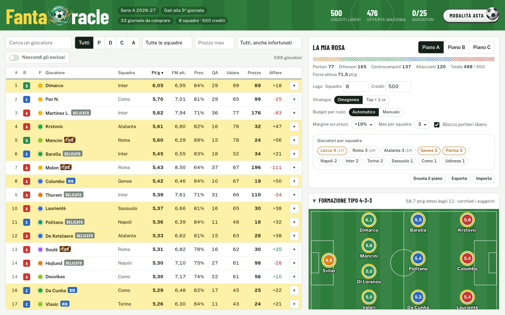
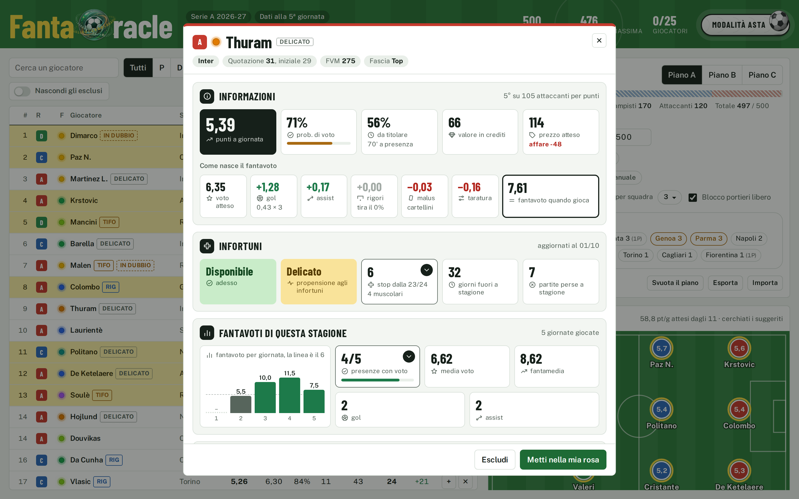
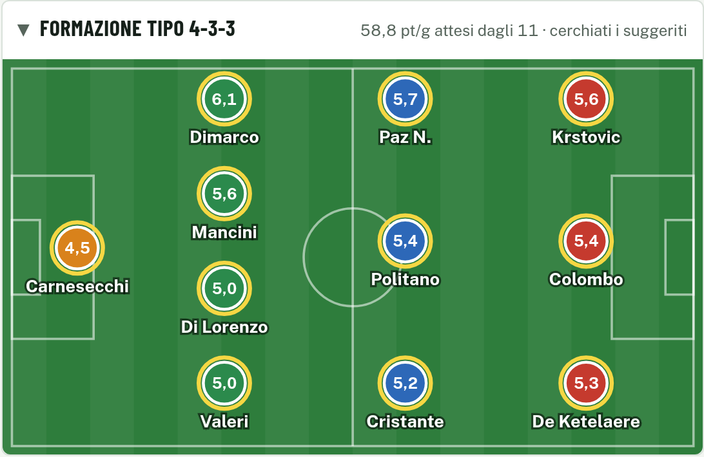
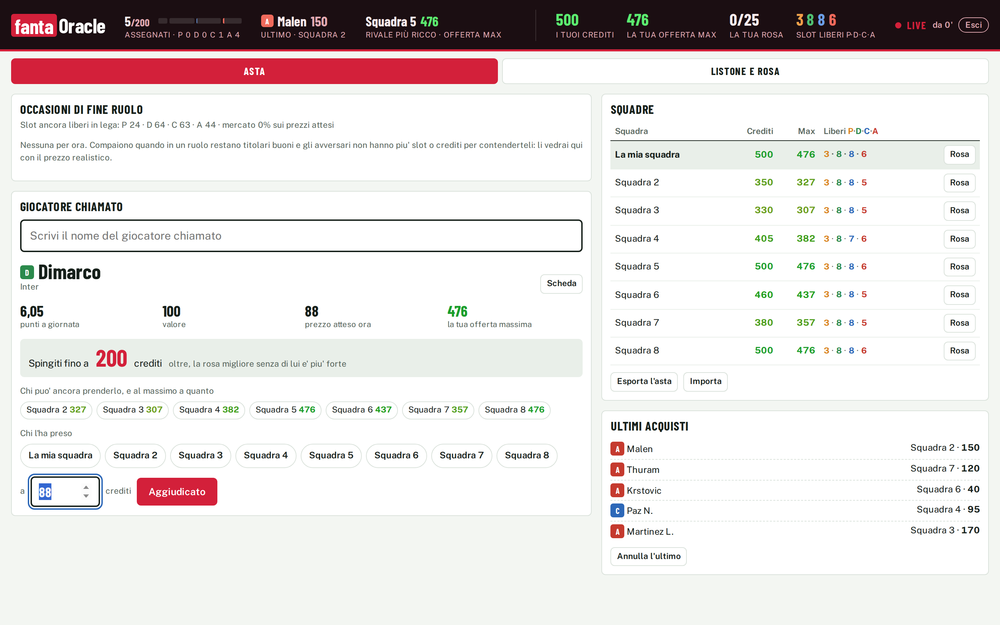
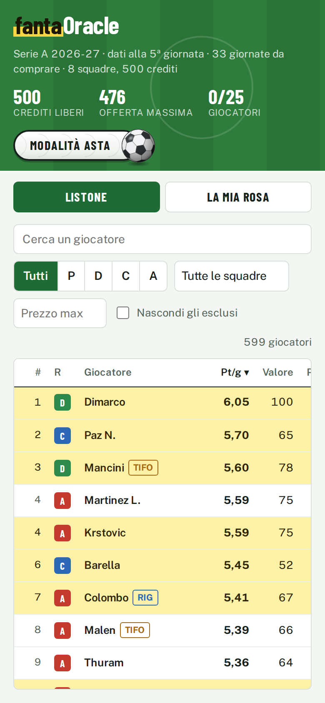

<h1 align="center">
  
</h1>

⚽ Vuoi fare il fantacalcio con gli amici ma non hai tempo di studiarti tutto il listone, e magari non segui neanche così tanto il calcio perchè:

<p align="center",>
  ☝🏻<em>"Non ci sono più i giocatori di una volta, questi pensano solo ai soldi!"</em>☝🏻
</p>

però comunque non riesci a smettere di vedere le partite della Maggica perchè Daje Roma Daje 🐺?

🔮 Ecco a te **FantaOracle**, la tua sfera di cristallo per il fantacalcio, un tool semplicissimo che **fa il lavoro sporco al posto tuo**, studiando per te le statistiche delle ultime stagioni (**gol attesi, assist, rigori, clean sheet, affidabilità sulla titolarità**) e trasformandole in una **stima dei fantapunti** che ogni giocatore porterà a giornata, senza che tu debba aprire un solo foglio Excel. ✨Ma c'è di più!✨

🔴 Il giorno dell'asta potrai avviare la **Modalità Asta** che ti guiderà passo passo durante la fase più calda di tutto il Fantacalcio, permettendoti di tenere sotto controllo la tua situazione e quella delle altre squadre, **ricalcolando dinamicamente i suggerimenti di acquisto** e la **possibile riallocazione del budget**, sulla base dell'andamento generale del mercato e dei crediti che tu e i tuoi avversari state spendendo, e mostrandoti nelle fasi finali le **"occasioni"** rimaste.

‼️ Tutte queste feature sono sempre dei **suggerimenti**, la scelta finale sarà sempre tua!

⏳**COMING SOON**: pensi che dopo averti aiutato a fare la miglior squadra possibile sarai abbandonato a te stesso, senza saper gestire una formazione così competitiva? Sta arrivando anche la **Modalità Formazione**, che combina tutti i migliori dati a disposizione per fornirti suggerimenti *ad hoc* per massimizzare il punteggio atteso di ogni giornata! 

### 👉 [Apri il tool](https://pimpi7.github.io/FantaOracle/)

Funziona nel browser, da computer e da telefono, senza installare nulla. I dati si aggiornano da soli ogni martedì e venerdì.



---

## Perché non basta la fantamedia

La fantamedia ti dice quanto ha preso un giocatore *quando ha giocato*. Ma chi gioca metà delle partite ti porta metà dei punti, un portiere da 5 e mezzo di media è un'altra cosa se la sua difesa ti regala il modificatore, e il nome in voga costa il doppio di quanto vale.

FantaOracle mette insieme tre stagioni di voti Fantacalcio.it, le prime giornate di quest'anno, le statistiche avanzate e le quote dei bookmaker, e per ogni giocatore stima **quanti punti porterà a giornata da qui a fine campionato**. Poi traduce quei punti in crediti, tenendo conto delle regole della nostra lega: 8 squadre, 500 crediti, h2h, modificatore difesa.

---

## Come si usa

### 1. Leggi il listone

I 599 giocatori delle 20 squadre di Serie A, ordinati per punti attesi. Filtri per ruolo, squadra, prezzo massimo o nome, e ordini per qualsiasi colonna: il numero a sinistra segue l'ordinamento.

| Colonna | Cosa ti dice |
|---|---|
| F | Un pallino colorato, a sinistra del nome, con la fascia della Guida all'Asta di [SOS Fanta](https://www.sosfanta.com/guida-asta-fantacalcio/guida-asta-fantacalcio-2026-2027-tutti-consigli-fasce-chi-prendere/), da *Super top* a *Da evitare*. Passandoci sopra col mouse (o toccandolo) vedi la legenda con tutti i colori. Cliccando sull'intestazione ordini per fascia. È l'opinione della redazione, da confrontare con i nostri numeri; spento per chi la guida non classifica. Gli infortunati, che la guida elenca a parte, hanno una fascia stimata da noi (pallino vuoto). Il pallino c'è anche nella scheda del giocatore e nella rosa. |
| **Pt/g** | Punti attesi a giornata. Il numero su cui ragionare. |
| FM att. | Fantavoto atteso quando scende in campo |
| Pres. | Probabilità che prenda voto in una giornata |
| QA | Quotazione attuale Fantacalcio.it |
| **Valore** | Quanto vale per te, in crediti |
| **Prezzo** | Quanto costerà presumibilmente nella nostra asta |
| **Affare** | Valore meno prezzo: più è alto, più conviene |

Le etichette **RIG** segnalano i rigoristi, **TIFO** i giocatori che in lega costeranno un po' di più perché qualcuno ci è affezionato.

🚑 Accanto al nome vedi anche chi è **infortunato**: **OUT → 8a** se salta le prossime giornate e rientra alla 8ª (con la data, passandoci sopra), **IN DUBBIO** se potrebbe esserci già alla prossima. E chi **si fa male spesso**: **FRAGILE** se negli ultimi tre anni ha perso almeno un quarto di stagione a forza di stop, **DELICATO** se ci va vicino. Un filtro ti lascia solo i disponibili, o solo i disponibili non fragili. Le giornate che un infortunato salta sono già tolte dai suoi punti attesi e dal suo valore; la fragilità invece è un avviso, la decisione è tua.

### 2. Apri la scheda di un giocatore

Un clic sul nome e hai tutto in una scheda a riquadri, da leggere a colpo d'occhio: **verde** va bene, **giallo** attenzione, **rosso** male. Le sezioni sono sempre nello stesso ordine:

- **Informazioni**: punti a giornata, probabilità di voto, valore e prezzo atteso, e come nasce il fantavoto pezzo per pezzo (voto, gol, assist, rigori, cartellini).
- **Infortuni**: come sta adesso, con la data di rientro e quanto farebbe da sano, e quanto spesso si ferma.
- **Fantavoti di questa stagione**: giornata per giornata, con presenze, media e fantamedia.
- **Griglia abbinamenti**, per **portieri e attaccanti**: come quella di [FantaLab](https://app.fantalab.it/griglia-portieri), ogni giornata che resta con l'avversario colorato secondo quanto è facile affrontarlo, e i **compagni con cui alternarlo**: con chi, schierando ogni turno quello con la partita migliore, hai quasi sempre una partita facile, e quanti punti a giornata ti fa guadagnare la coppia. Tocca un compagno e la coppia finisce nella griglia.

Tabelle ed elenchi (gli stop dalla 23/24, le stagioni passate, tutti i compagni) restano chiusi: si aprono toccando il riquadro con la freccia. In fondo, sempre a portata, i bottoni per metterlo in rosa o escluderlo dai suggerimenti (se non lo vuoi, o per vedere come cambia il piano se te lo soffiano).



### 3. Costruisci la rosa

Aggiungi chi vuoi, al prezzo che pensi di pagarlo, con il **+** nel listone o dalla scheda. Il tool riempie gli slot vuoti con la combinazione più forte che sta nel budget che ti resta, la evidenzia in giallo e la ricalcola a ogni tuo cambiamento. Per ogni suggerito trovi le alternative (**Altri**) e puoi sceglierlo con un clic.

Rispetta sempre la rosa 3-8-8-6, i 500 crediti e il limite di giocatori della stessa squadra reale. In cima trovi la **formazione tipo** disegnata sul campo, nel modulo che rende di più.

Portieri e attaccanti li sceglie **giornata per giornata**: ogni turno conta chi ha la partita più comoda, quindi due portieri che si coprono il calendario valgono più dei loro punti presi da soli. Sotto i tuoi portieri vedi in quante giornate almeno uno affronta una squadra facile e quanto rende l'alternanza.



Le impostazioni che puoi cambiare:

- **Strategia**: *Omogenea* distribuisce i crediti dove rendono di più; *Top + 1 cr* chiude gli ultimi slot con giocatori da un credito e concentra il budget sui titolari.
- **Budget per ruolo**: automatico, oppure fissi tu quanti crediti dare a portieri, difensori, centrocampisti e attaccanti.
- **Lega**: numero di squadre e crediti a squadra. Se non sono 8 e 500, valori e prezzi vengono ricalcolati per la tua lega (le proiezioni in punti non cambiano).
- **Margine sui prezzi**: quanto prudente essere sulle stime di prezzo.
- **Max per squadra** e **blocco portieri**: quanti giocatori della stessa squadra reale accettare, con i portieri che possono fare eccezione.
- **Piani A, B, C**: tre rose alternative salvate nel browser, esportabili come testo per passarle da un dispositivo all'altro.

### 4. Il giorno dell'asta: calcio d'inizio

Premi il bottone col pallone in testata: il pallone rotola, ti viene incontro e apre il setup. **Modalità asta** trasforma il tool nel tuo assistente live. Dai un nome alle 8 squadre, scegli quale piano usare come lista obiettivi, e parti.



- **Tabellone in alto**: quanti giocatori sono già stati assegnati, ruolo per ruolo, l'ultimo colpo e chi è il rivale più ricco, accanto ai tuoi crediti, alla tua offerta massima e ai tuoi slot ancora liberi.
- **Giocatore chiamato**: scrivi il nome e vedi subito punti, valore, prezzo atteso e la tua offerta massima. Soprattutto vedi **fin dove spingerti**: il prezzo oltre il quale la rosa migliore senza di lui diventa più forte.
- **Chi può ancora prenderlo**: gli avversari che hanno slot e crediti, con la loro offerta massima.
- **Registra l'acquisto**: chi l'ha preso e a quanto. Il tool aggiorna crediti e slot di tutti, ricalcola i suggerimenti e adegua i prezzi al mercato reale della serata.
- **Occasioni di fine ruolo**: quando gli avversari hanno riempito un ruolo o finito i crediti, i giocatori buoni rimasti compaiono in cima con il prezzo a cui puoi realisticamente portarli via.
- **Squadre**: crediti, offerta massima e slot liberi di ognuno, con i numeri che passano dal verde al rosso man mano che si svuotano.

Puoi **sospendere** l'asta e riprenderla più tardi, oppure **chiuderla**: le rose finali restano salvate nel browser e ti viene data subito una copia di testo da conservare.

### Da telefono

Stesso tool, con due schede: *Listone* e *La mia rosa*.



---

## Quanto ci si può fidare

Il modello è stato messo alla prova sulle due stagioni passate: congelato alla quinta giornata, come se l'asta fosse quel giorno, e confrontato con quello che i giocatori hanno fatto davvero dopo. Ordina i giocatori meglio della fantamedia e della quotazione, ma di poco: il calcio resta imprevedibile e nessun numero ti salva da un infortunio a novembre. Usalo per non strapagare e per non dimenticarti di nessuno, non come un oracolo.

Anche l'alternanza è stata provata: fra due portieri titolari, schierare ogni giornata quello con la partita migliore ha cambiato scelta in circa una giornata su sette, e quando ha cambiato ha fatto in media fra 0,2 e 0,5 punti in più. Per gli attaccanti l'effetto è più piccolo.

Tutti i dettagli su dati, modello, backtest e ottimizzatore sono in **[specifiche.md](specifiche.md)**.

---

## Installazione locale

Serve Python 3.11 o superiore.

```bash
git clone https://github.com/Pimpi7/FantaOracle.git
cd FantaOracle
pip install -e ".[dev]"
python -m fantaoracle all          # scarica i dati, costruisce il database, calcola il modello
cd web && python -m http.server    # poi apri http://localhost:8000
```

Il tool va aperto tramite un server locale (quello di Python va benissimo): aperto direttamente dal disco, il browser blocca la lettura dei dati. Le regole della lega stanno tutte in [`config/league.yaml`](config/league.yaml); i singoli comandi della pipeline sono descritti nelle [specifiche](specifiche.md#avvio).
